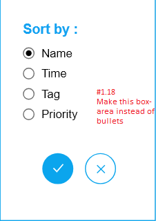
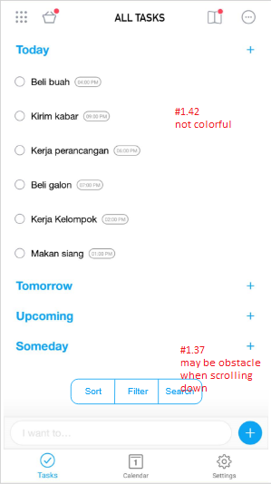
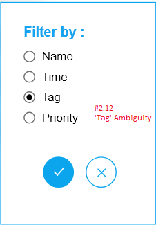
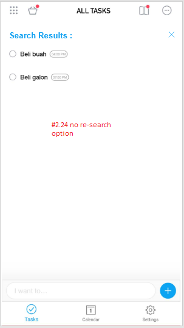
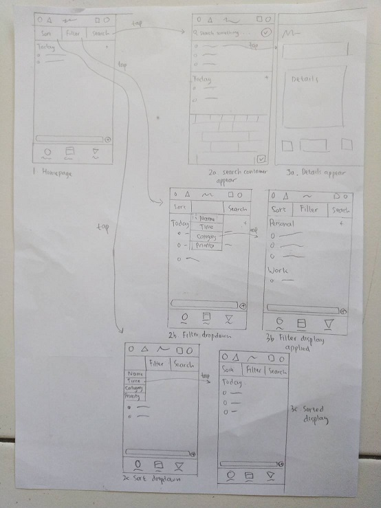

# Usability Evaluation and Prototyping (again)
> Usability Evaluation in this assignment is to evaluate your high-fidelity interactive-prototype with two participants:
> the participant from the previous Contextual Inquiry (CI) 
> and an additional novice-participant with different demographics if possible.
> Respectively, revise your prototype as an attempt to fix any problems found in this Usability Evaluation.

## Operating the Prototype
Remaked hi-fi prototype using Adobe XD. Linked the prototype demonstration below.

[Prototype Video](https://youtu.be/IYG0LkOd58M?t=72)

---

## Part A: Usability Evaluation
> In this part, you should prepare your high-fidelity interactive-prototype from the assignment 2.
> Invite the participant from your previous CI to test the prototype.
> You also need to invite one more novice participant.
> As with the CI, you might need to videotape your sessions.
> You can benefit from the videotape while writing your `Recording Transcript` later.

### 1. Brief Description of Participants
> Describe your participants in bullets or sentences.
> The description should contain their demographic (age, gender, occupation),
> their skill level in using the system, and your reasons choosing them.
> The description should NOT contain any personally identifiable information.

#### a. Description of Participant 1
- Male, 19 years old
- Currently studying at Marine Engineering (ITS).
- Is the participant from the previous CI.
- Selecting this participant because he is a novice, and have no experience in using Any.do mobile application. 

#### b. Description of Participant 2
- Male, 20 years old
- Currently studying at Information Systems (not ITS).
- Selecting this participant to add perspective from a mid-skilled person in using varieties of software, but doesn't have any experience operating this mobile app.

### 2. Evaluation Script
> Write the questions you ask and the instructions you use to direct the participants on what to do.
> If it is the same as previous assignments, please mention this, yet go ahead and INCLUDE it again,
> so we have everything in one place.
> Note that the evaluation script must include exactly what you plan to say to the participants.

1. Comment about overall home display.
2. Try to sort the activities based on name.
3. Try to filter the activities based on tags.
4. Try to search the activities based on 'Beli' keyword.

### 3. Transcript
> Provide a summary of what the participant did and said, and what you did and said.
> If at some points you have to help the participants, because they cannot figure out what to do,
> that scene must be included in the transcript.
> It is not necessary to write down every word the participant said,
> just what is interesting and useful.
> Ensure to write down all the actions on the device, whether correct or wrong.
> Remember to supplement the transcript with time-codes or line-numbers.

#### a. Transcript with Participant 1
```text
(begin)
 1. Me: Kali ini hampir sama yang seperti dulu, silakan beri komentar sejelas-jelasnya, misalkan ada 
 yang positif silakan dikomentari, kalau misalkan ada yang negatif disebutkan, bagus lagi kalau 
 kasih saran.
 2. Participant: Ya.
 3. M : Bagaimana komentarmu terhadap overall homepage
 4. P : Overall simple, UI-nya mirip IOS.
 5. M : Masih ingat homepage pada CI yang dulu?
 6. P : Masih
 7. M : Ada yang beda atau tidak?
 8. P : Ada font tulisan all tasks nya beda.
 9. M : Ada saran?
10. P : Mana saya tau, kan saya belum pakai fitur2nya.
11. M : Coba semua aktivitas yang ditampilkan diurutkan berdasarkan nama.
12. P : (Mencoba mengklik semua tombol yang terlihat)
13. M : Diurutkan berdasarkan namanya, jadi tidak perlu menambah aktivitas lagi.
14. P : Kok tidak bisa dipencet (sambil mengklik tombol2 lain)
15. M : Ya, memang beberapa tombol hanya bisa dipencet, yang terkait dengan instruksi saja.
(02:10 menemukan sort dan berhasil melakukan sort)
16. P : Sudah, terurutkan sesuai abjad.
17. M : Ada komentar terhadap apa yang baru saja dikerjakan?
18. P : Biasa aja sih, kayanya gausah pakai model bullet, kurang bagus, mending langsung pakai tombol saja.
19. M : Maksudnya pakai tombol seperti apa?
20. P : Lebih bagus langsung pakai block-block aja. Itu saja.
21. M : Ok, ke instruksi kedua, coba dikelompokkan berdasarkan tag.
22. P : (memilih menu sort, kemudian mencoba menu filter, memilih bullet tag, confirm)
(03:44 menemukan filter dan menggunakan filter tag)
23. M : Apa yang berubah?
24. P : Kalau tadi kategorinya pakai time munculnya berdasarkan waktu, kalau ini work dan personal.
25. M : Apa yang anda rasakan, adakah komentar?
26. P : Udah bagus, memang filter menjadi kewajiban bagi aplikasi to-do seperti ini.
27. M : Setelah ini, coba untuk mencari dari aktivitas dengan kata kunci 'Beli'
28. P : (menemukan search, mencoba menghapus kata kunci yang sudah disediakan di mock up, kemudian memilih proceed.)
(05:02 menemukan search dan berhasil melakukan pencarian)
29. P : Sudah.
30. M : Coba dikembalikan ke homepage.
31. P : (menekan x di sebelah search result untuk menutup search) Sudah.
32. M : Apakah ada saran atau komentar dari search tadi?
33. P : Mau tanya, kalau aslinya nanti resultnya real-time atau tidak?
34. M : Tidak, muncul halaman baru.
35. P : Tombol centang nya untuk search dibesarin sedikit. Kalau pakai hape tombol bulat yang kecil ini 
agak susah. Atau search result jangan dibuat page baru, jadi alih-alih membuat search bar yang satu layar, 
coba bikin kontainer untuk search di homepage. Itu bisa membantu kalau list kita banyak.
36. M : Baik, sebagai penutup, silakan ceritakan atau beri komentar terhadap overall yang sudah Anda jalankan.
37. P : Kalau di hp kan sering scroll keatas ya, apa baiknya tombol utility ditaruh di atas saja, jadi 
kalau misalkan di scroll tidak menghalangi jempol kita. Yang kasus search tadi, misal jadi ditaruh 
diatas, waktu dipencet bisa muncul kontainer buat nyari, jadi bisa kita bikin real-time pencarian, 
dengan hasil kayak dropdown di bawah kontainernya itu. 
38. M : Baik, betul juga itu.
39. P : Atau kalau dikasih dropdown, semua list digeser kebawah semua. Soalnya kalau search bar nya di 
page baru kayak berkesan hilang semua.
40. P : Kalau yang sort , dikasih pop-up dibawahnya aja.
41. M : Baik, ada lagi?
42. P : Menurut saya, ini kurang berwarna. Kalau bisa dibuat ada icon2 minimalis sama colorful, 
karena orang akan cepat bosan kalau aplikasi penjadwalan tapi 'monochrome'
43. M : Maksudnya kalau tiap2 tag memiliki warna unik , seperti itu?
44. P : Ya bisa.
45. M : Baik, sepertinya cukup. Terimakasih.
(end)
``` 
 

#### b. Transcript with Participant 2
```text
(begin)
 1. Me : Disini nanti kamu akan menguji mockup dari suatu mobile application. (Menampilkan app) Jadi ini 
 merupakan aplikasi mobile Any.do, merupakan aplikasi yang bisa mengelola jadwalmu, sama reminder. 
 Jadi nanti tugasmu itu menguji sistemnya, bukan saya yang menguji kemampuanmu. Nanti saya memberi 
 instruksi untuk menjalankan ini. Silakan diceritakan dan diberi komentar tentang apa yang Anda 
 lakukan nantinya. Silakan diutarakan seperti, saya suka biru, atau ini kurang kecil, dll.
 2. Participant : Baik
 3. M : (menampilkan homepage) Coba berikan overall / first impression terhadap homepage ini.
 4. P : Saya suka homepagenya, tulisannya agak terlalu tebal gitu, ditipisin lebih bagus. 
 Saya agak familiar dengan desain kayak gini. Pembagian personal, work, kategori cukup bagus.
 5. M : Ok. Ke instruksi pertama, coba urutkan aktivitas sesuai dengan namanya.
 6. P : Ini di klik di drag? (mencoba mengurutkan manual)
 7. M : Coba gunakan fitur yang tersedia.
 8. P : (sempat memilih filter, namun menyadari ada sort)
(03:56 menemukan sort dan berhasil mengurutkan)
 9. M : Apakah sudah terurut?
10. P : Ya. Sudah.
11. M : Ada komentar terhadap apa yang sudah dilakukan?
12. P : Bagus si. Agak ambigu untuk pilihan tag di sort itu maksudnya apa, soalnya di home 
tidak ada yang mencerminkan tag. Sama priority tidak ada tandanya di home, mana yang 
merah / tinggi , mana yang rendah. Lebih baik dikasih warna di aktivitasnya.
13. M : Baik, ke instruksi selanjutnya. Coba aktivitasnya dikelompokkan berdasarkan tag.
14. P : (Masih mencoba di sort) Maksudnya?
15. M : Tampilannya nanti dikelompokkan sesuai tagnya nanti.
(06:03 menemukan filter dan berhasil mengelompokkan)
16. M : Ada yang berbeda atau tidak?
17. P : Tidak.
18. M : Coba dikelompokkan menjadi waktu, apakah ada perbedaan pengelompokkan dengan tag?
19. P : Tidak. (tidak menyadari perubahan kategori)
20. M : (menjelaskan perubahan)
21. P : Oh. Baru tau. Mungkin gini, saya kurang jelas mengenai tag. Menurut saya ambigu, lebih cocok 
diganti jadi filter by category.
22. M : Coba yang ketiga, cari aktivitas dengan kata kunci 'Beli'
(09:24 menemukan search dan berhasil mencari)
23. M : Coba dikembalikan ke halaman utama.
24. P : Sudah. Waktu result nya muncul harus di close dulu untuk mbuka search lagi, ini ribet. Lebih baik dibuat di 
halaman result ini, bisa nge-search lagi tanpa balik ke halaman utama.
25. M : Baik, sepertinya cukup. Terima kasih.
(end)
```

### 4. Feedback and Incidence Analysis
> Record your observations per prototype screen followed by reference, feedback, incidence, reason, and resolution.

#### OBSERVATION 1
<p align="center">
  <br>
</p>

 - **Reference**: #1.18
 - **Feedback**: Given suggestion to change the bullets into boxes. (#1.18)
 - **Incidence**: User clicked the area of text instead of the bullet.
 - **Reason**: Reduced aesthetic when using bullets - user suggestion (#1.18)
 - **Resolution**: Make the option into box-based options (#1.20).
 
#### OBSERVATION 2
<p align="center">
  <br>
</p>

 - **Reference**: #1.37 , #1.42
 - **Feedback**: 
    - The activity looks boring / no color (#1.42) 
    - Not a good placement. (#1.37)
 - **Incidence**: No Critical incidences (because evaluation occurs on the desktop)
 - **Reason**: 
    - Personal opinion (#1.42)
    - Feature might be an obstacle to scrolling the phone. (#1.37)
 - **Resolution**: 
    - Make the activity colorful (#1.42) - note : mock up doesn't contain any colorful activities, but there are features already to make the activities colorful.
    - Make the features in the upper side of the phone (#1.37)
 
#### OBSERVATION 3
<p align="center">
  <br>
</p>

 - **Reference**:  #2.13
 - **Feedback**: Difficulties in doing task (#2.14)
 - **Incidence**: Takes more time in finding the right steps to sort & filter by categories (#2.12, #2.17, #2.19, #2.21)
 - **Reason**: Ambiguity in 'tag' word. (#2.21)
 - **Resolution**: Suggestion to change tag word into category. (#2.21)
 
 #### OBSERVATION 4
<p align="center">
  <br>
</p>

 - **Reference**:  #2.24
 - **Feedback**: Complexity (#2.24)
 - **Incidence**: User feel to do more extra energy (#2.24)
 - **Reason**: 
    - Too complex (#2.24)
 - **Resolution**: 
    - Making extra search bar on search result instead of returning then re-search again (#2.24)
 
 ---

## Part B: Prototyping (again)
This prototype below made by some consideration based on `Feedback and Incidence Analysis`'s observations.

### Sketch

<p align="center">
  <br>
</p>


### Design Rationale
> Please write a paragraph expressing what you have learned from the usability evaluation, 
> and how it is reflected in your design.
In general, from usability evaluation, I can get feedbacks and different perspective, or maybe some ideas to make the design more better at the context of usabilities, because I got feedbacks from the possible future users of the app / who will use the app. It also helps us (designers) to think what's good for us doesn't mean it's always also good to the users. So we doing Usability evaluation to ensure the design is fitted to the user needs.

### High-Fidelity Interactive-Prototype
Using Adobe XD. 